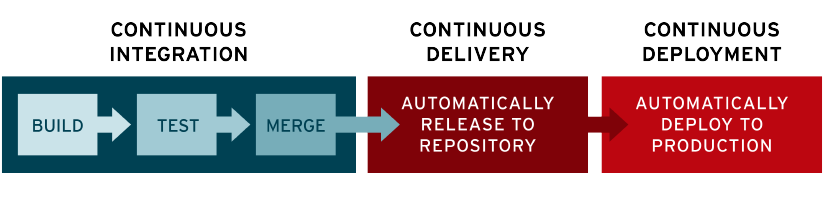

## CI/CD란 무엇인가?

CI/CD는 애플리케이션 개발에 있어서 각 단계를 자동화하여, 애플리케이션을 보다 짧은 주기로 고객에게 제공하는 방법입니다. CI/CD는 다음의 요소로 구성됩니다. '지속적인 통합', '지속적인 배포', '지속적인 제공'입니다. CI/CD는 기존의 코드 통합을 하는 과정에서 발생하는 문제를 해결하기 위한 솔루션입니다.

CI/CD는 애플리케이션의 통합 및 테스트 단계, 배포 및 서비스 제공의 라이프 사이클에 걸쳐서 지속적인 **자동화**와 **모니터링**을 제공해야합니다.

### CI(Continuous Integration)

CI는 개발자를 위한 자동화 프로세스입니다. CI를 성공적으로 구현한 경우 애플리케이션의 새로운 코드 변경사항이 정기적으로 빌드 및 테스트된 후 코드 저장소에 통합됩니다. 이렇게 통합된 코드를 사용하기 때문에 애플리케이션 개발과 관련된 작업을 할 때, 충돌이 사전에 해결되어 충돌로 인한 문제가 일어나지 않을 수 있습니다.

CI의 필수 요소는 '코드의 통합', '자동화된 테스트', '자동화된 빌드'입니다.

### CD(Continuous Deploy & Continuous Delivery)

CD는 지속적인 배포와 지속적인 제공을 의미합니다. 둘을 모두 하는 경우가 있고, 둘 중 하나만 하는 경우도 있습니다. 이는 파이프라인에 얼마나 많은 추가적인 자동화가 들어갔는지를 의미하기도 합니다.

지속적인 배포는 코드 저장소의 변경 사항이 사용자가 사용 가능한 프로덕션 환경까지 자동으로 릴리스되는 것을 의미합니다. 이것을 수행하기 위해서는 배포 자동화가 이루어져야 합니다.

지속적인 제공은 적용한 사항이 테스트를 거쳐 코드 저장소에 자동으로 업로드 되는 것을 뜻하며, 이 저장소에서 실시간으로 배포하기 위한 준비를 하는 것이 지속적인 제공입니다. 지속적 제공의 목표는 최소한의 노력으로 새로운 코드를 배포하는 것입니다.

지속적인 제공은 지속적인 배포를 포함하는 경우가 많으므로 둘을 함께 생각해도 됩니다. 결국  CD의 최종적인 목표는 저장소의 코드베이스를 자동화를 통해서 사용자에게 빠르게 배포하는 것에 있다고 보시면 됩니다. 

## 일반적인 CI/CD 구현 순서

일반적으로 파이프라인을 구성해나가는 것이기 때문에 CI 부터 구성하는 경우가 많습니다.

CI에서의 핵심은 코드의 버전관리도 있겠지만, 자동화된 테스트 코드를 작성하는 것입니다. 그리고 이를 모니터링 할 수 있는 수단을 제공하면 됩니다.

## CI/CD를 왜 해야하는가?

### CI를 해야하는 이유

CI를 하면 코드 변경사항들이 지속적으로 공유 브랜치에 통합됩니다. 이 과정에서, 충돌을 해결하고 병합하는 과정을 바로바로 수행하기 때문에 코드를 합치는데 걸리는 시간이 상대적으로 줄어들게됩니다.

또한, 이러한 변경 사항은 테스트 코드가 강제되는 CI 환경에서 매우 큰 강점을 보이는데, 병합 과정이나 코드 작성과정에서 테스트를 깨트리는 경우 해당 코드에 대해서 테스트 코드 및 빌드가 실패하는 것을 가시적으로 확인하여 코드에 문제가 있음을 알려줄 수 있습니다.

자동화된 테스트는 단위 테스트 및 통합 테스트가 있으며 이런 변경사항을 빠르게 확인해서 적용이 잘 되었는지 확인할 수 있습니다. 단위 테스트는 클래스, 메서드 수준에서 테스트를 수행하고, 통합 테스트는 전반적인 애플리케이션을 구성하는 모듈들의 동작에 중점을 둡니다. 의미있는 테스트를 많이 만들어두면, 버그를 더욱 빠르게 자주 수정할 수 있습니다.

여기에 추가적으로 스타일 체크 도구, 정적 분석 도구나, 테스트 커버리지 측정 도구까지 붙여서 더 많은 일을 자동화할 수 있습니다.

이렇게 CI를 마치면, 바로 프로덕션 서버에 배포하는 것이 아니라, 테스트 환경, 스테이징 환경(프로덕션 서버를 모방한 서버)을 거쳐 배포됩니다. 이렇게 하면 변경된 사항이 잘 동작하는지, 실제 서비스를 사용하는데에는 문제가 없는지 알 수 있게됩니다. 그리고 이러한 환경구성을 통해 실제 배포환경에 배포되었을 때 발생할 수 있는 문제에 대해 쉽게 대처할 수 있습니다.

또, QA 팀이 존재하는 경우 수동 테스트를 수행할 수 있는 환경도 마련해줄 수 있습니다.

### CD를 해야하는 이유

애플리케이션을 프로덕션으로 릴리스하는 작업마저 자동화 하는 것으로, 애플리케이션 개발과 배포 주기가 짧아지게 되어, 사용자 피드백을 지속적으로 수신하고 통합하는 일이 수월해집니다.

이런 CI/CD를 잘 구현한다면, 애플리케이션 배포의 위험성 마저도 줄여주므로, 애플리케이션을 한 번에 릴리스하는 것이 아니라, 작은 조각으로 세분화하여 릴리스 할 수 있도록 해줍니다.

## CI/CD 도구엔 어떤 것들이 있는가?

CI/CD 도구는 정말 다양한 종류의 도구들이 있습니다.

- Jenkins
- Circle CI
- Travis CI
- Github Actions
- AWS Code Pipeline(AWS CodeCommit(CI), AWS CodeDeploy(CD))
- Azure DevOps
- Atlassian Bamboo

이 중 제가 사용해본 도구들은 Jenkins, Github Actions, AWS CodeDeploy입니다.

이에 대해서는 발표를 통해 알아보겠습니다.

## 참고

[CI/CD(지속적 통합/지속적 제공): 개념, 방법, 장점, 구현 과정](
