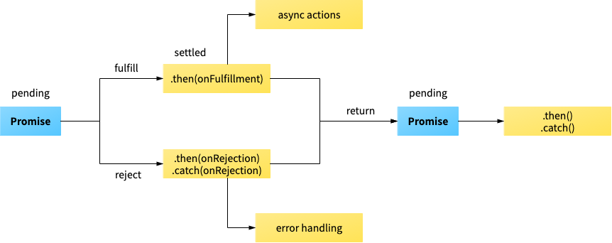

비동기 코드를 꺼내기 전에, 동기가 무엇인지 간략히 알아보겠습니다.

동기 방식은 한 작업이 끝나야만 다른 작업을 수행하는 것이라고 볼 수 있습니다.

`alert()` 가 대표적으로, `alert()` 가 동작중일 때에는 다른 모든 작업들이 중단됩니다.

멀티스레딩을 사용하면 다른 처리를 동시에 할 수 있겠지만 안타깝게도 자바스크립트는 싱글 스레드 입니다.

그래서 자바스크립트에서는 비동기가 중요합니다.

# Asynchronous JavaScript

그래서 많은 웹 API 기능들은 비동기 코드를 사용하여 실행되고 있습니다.

특히, 외부 디바이스에서 어떤 종류의 리소스에 액세스하거나 가져오는 기능들에 많이 사용합니다. (네트워크에서 파일을 가져오거나, 데이터베이스에 접속해 특정 데이터를 가져오는 일, 웹 캠에서 비디오 스트림에 액세스하거나, 디스플레이를 VR 헤드셋으로 브로드캐스팅 하는 것)

동기를 사용하면 무엇이 문제일까요? 서버에서 이미지를 가져올 때는 네트워크 환경, 다운로드 속도 등의 영향을 받아 이미지를 즉시 확인할 수 없습니다.

개발자는 이를 모두 고려해서 응답을 받을 때 까지 기다렸다가 처리를 수행하게끔 해줘야 합니다.

자바스크립트에서는 비동기 방식을 두 가지 유형으로 제공합니다. 이전 방식인 callbacks와 새로운 방식인 promise-style 코드 입니다.

## Callbacks

Async callbacks는 백그라운드에서 코드 실행을 시작할 함수를 호출할 때, 인수로 지정된 함수입니다. 백그라운드 코드 실행이 끝나면 callback 함수를 호출하여 작업이 완료됐음을 알리거나, 다음 작업을 실행하게 할 수 있습니다.  지금은 약간 구식이지만, 많은 곳에서 사용되고 있습니다.

```jsx
btn.addEventListener('click', () => {
  alert('You clicked me!');
});
```

이 코드에서 화살표함수가 callback 함수입니다. callback함수는 인수로 전달될 뿐이지 즉시 실행되지 않고, body에서 "called back" 됩니다.

Callback은 다재다능 합니다. 함수가 실행되는 순서, 함수간에 어떤 데이터가 전달되어야 하는지를 제어할 수 있습니다. 또한 상황에 따라 다른 함수로 데이터를 전달해줄 수 있습니다. 응답된 데이터에 따라 어떤 작업을 수행할지도 결정해줄 수 있습니다.

모든 callback이 비동기는 아닙니다. `Array.prototype.forEach()` 을 사용하여 배열의 항목별로 작업을 수행할 수 있습니다. 하지만 이는 비동기가 아니라 즉시 실행됩니다.

## Promises

프로미스는 모던 Web APIs 에서 보게 될 새로운 코드 스타일입니다. 가장 쉬운 예로 `fetch()` API가 있습니다.

최근에는 `XMLHttpRequest` 보다 `fetch()` 가 더 현대적이어서 많이 사용합니다.

`fetch()` 는 네트워크에서 가지고오고 싶은 리소스의 URL을 매개변수로 받습니다. 그리고 `promise` 로 응답합니다.

`promise` 는 비동기 작업이 성공했는지 혹은 실패했는지를 나타내는 하나의 오브젝트 입니다. 즉, 성공과 실패의 분기점이 되는 상태입니다. 왜 promise냐면, "내가 할 수 있는 한 빨리 당신의 요청의 응답을 가지고 돌아간다고 약속(promise)할게"라는 브라우저의 표현 방식이기 때문입니다. 슈뢰딩거의 고양이 같다고도 볼 수 있습니다.

이 `fetch()` 작업이 끝나면, 두 가지 작업을 수행해야 합니다.

- `then()` : 이적 작업이 성공했을 때 수행할 작업을 나타내는 callback 함수입니다. 각 callback함수는 이전작업의 성공 결과를 전달받고, 성공했을 때의 코드를 callback 함수 안에 작성하면 됩니다. 각 `then()` 블럭은 다른 promise를 반환합니다. 이 말은 `.then()` 을 체이닝해서 작업을 수행하도록 할 수 있음을 말합니다. 순서대로 처리할 수 있게됩니다.
- `catch()` : 이 블럭은 `.then()` 이 하나라도 실패하면 동작합니다. 이는 `try ... catch` 와 유사하게 동작합니다. `error` 오브젝트를 `catch()` 블럭 안에서 사용할 수 있으며, 발생한 오류를 보고하는 용도로 사용할 수 있습니다. 또, 주의할 점은 `try ... catch` promise와 함께 동작할 수 없습니다.

promise와 같은 비동기 작업은 **event queue**에 들어갑니다. 그리고 main thread가 끝난 후 실행되어 후속 코드가 차단되는 것을 방지합니다. queued 작업은 가능한 한 빨리 완료되어, JavaScript 환경으로 결과를 반환해줍니다.

### 프로미스가 가지는 이점

- 여러 개의 연쇄 비동기 작업을 할 때 연쇄적으로 작성하기 더 좋습니다. callback은 더 어렵습니다. 그리고 이를 구현하려면 callback hell로 잘 알려진 패턴을 마주할 수 있습니다.
- 프로미스 콜백은 엄격한 순서로 호출됩니다.
- 예외처리가 간결해집니다. 예외가 발생하면 `.catch()` 블럭으로 처리해줄 수 있습니다.
- 구식 callback 패턴은 서드파티 라이브러리에 전달될 때 함수가 어떻게 실행되어야 하는 방법을 상실하는 반면 promise는 그렇지 않습니다.

### 비동기 코드 작성시 유의할 점

동기 코드와 비동기 코드가 혼용되어서 사용될 때, 헷갈릴 수 있습니다.

```jsx
console.log("registering click handler");

button.addEventListener('click', () => {
  console.log("get click");
});

console.log("all done");
```

이 코드는 클릭이 될 때 까지 "get click" 은 출력되지 않습니다.

또, 외부에 요청하는 경우에 요청에 대한 응답을 받기도 전에 해당 객체의 속성을 호출하면 `undefined`가 사용될 수 있습니다.

## 프로미스의 세 가지 상태(states)

프로미스를 사용할 때 알아야 하는 것이 바로 프로미스의 상태입니다. 이 상태는 프로미스의 처리과정을 의미합니다. 프로미스는 생성되고 종료될 때까지 세 가지 상태를 갖습니다.

- Pending(대기): 비동기 처리 로직이 아직 완료되지 않은 상태(실행중인 것도 의미하는건가?)
- Fulfilled(이행): 비동기 처리가 완료되어 프로미스가 결과 값을 반환해준 상태
- Rejected(실패): 비동기 처리가 실패하거나 오류가 발생한 상태

### Pending(대기)

먼저 `new Promise()` 로 프로미스를 대기상태로 만들어줍니다.

`new Promise()` 는 호출할 때, 콜백 함수를 선언해 줄 수 있고, 콜백 함수의 인자는 `resolve`, `reject` 입니다.

```jsx
new Promise(function(resolve, reject) {
  // ...
});
```

### Fulfilled(이행), 완료

여기서 콜백함수의 인자 `resolve` 를 실행하면 이행(Fulfilled) 상태가 됩니다.

```jsx
new Promise(function(resolve, reject) {
  resolve();
});
```

그리고 이행 상태가 되면 아래와 같이 `then()` 이용하여 처리 결과 값을 받을 수 있습니다.

```jsx
function getData() {
  return new Promise(function(resolve, reject) {
    var data = 100;
    resolve(data);
  });
}

// resolve()의 결과 값 data를 resolvedData로 받을 수 있습니다.
getData().then(function(resolvedData) {
  console.log(resolvedData); // 100
});
```

### Rejected(실패)

`new Promise()` 로 프로미스 객체를 생성하면 콜백 함수 인자로 `resolve` 와 `reject` 를 사용할 수 있었습니다.

`reject()` 를 호출하면 Rejected 상태가 됩니다.

```jsx
new Promise(function(resolve, reject) {
  reject();
});
```

그리고, 실패 상태가 되면 실패한 이유(실패 처리의 결과 값)를 `catch()` 로 받을 수 있습니다.

```jsx
function getData() {
  return new Promise(function(resolve, reject) {
    reject(new Error("Request is failed"));
  });
}

// reject()의 결과 값 Error 를 err로 받습니다.
getData().then().catch(function(err) {
  console.log(err); // Error: Request is failed.
});
```

프로미스 처리 흐름



또, 프로미스는 위의 `fetch()` 를 설명했던 것 처럼 `.then()` 으로 체이닝을 수행해줄 수 있습니다.

`then()` 의 두 번째 인자로 에러를 처리해줄 수도 있으나, 가급적이면 `catch()` 를 사용합니다.

```jsx
// catch()로 오류를 감지하는 코드
function getData() {
  return new Promise(function(resolve, reject) {
    resolve('hi');
  });
}

getData().then(function(result) {
  console.log(result); // hi
  throw new Error("Error in then()");
}).catch(function(err) {
  console.log('then error : ', err); // then error :  Error: Error in then()
});
```

이 코드는 에러를 잡지 못합니다. 따라서 모든 프로미스의 끝에 `catch()` 를 붙여주는게 좋겠습니다.

### 참고

[Introducing asynchronous JavaScript](https://developer.mozilla.org/ko/docs/Learn/JavaScript/Asynchronous/Introducing)

[자바스크립트 Promise 쉽게 이해하기](
