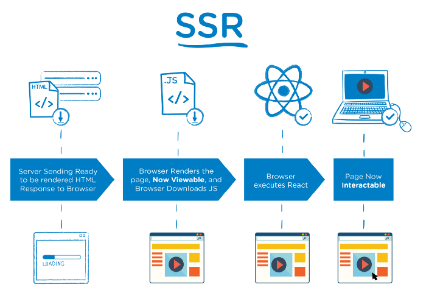
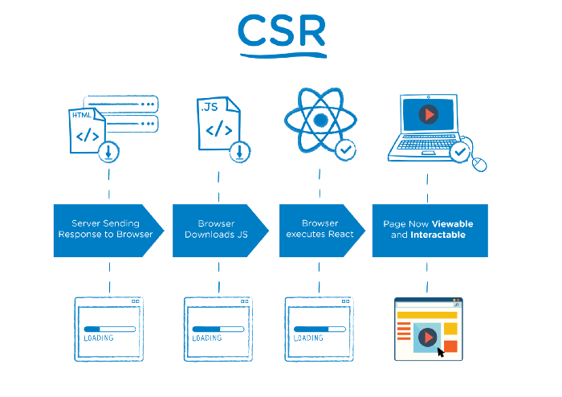
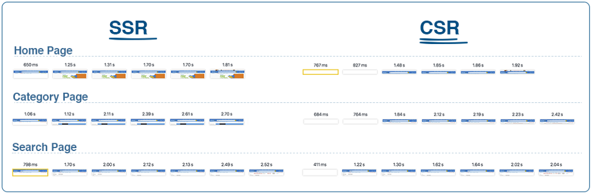
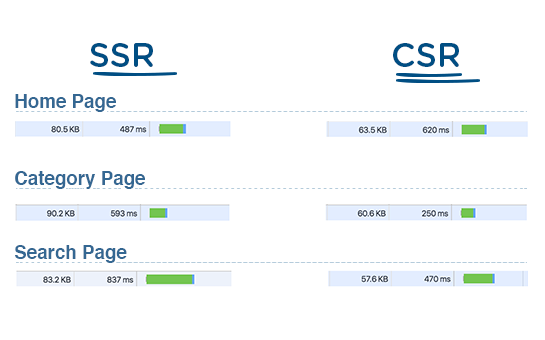

# SSR와 CSR

Server Side Rendering(SSR), Client Side Rendering(CSR)은 웹 페이지를 렌더링 할 때, 어떤 시점에 렌더링을 해야할지 구분합니다.

이 논의가 나오는 이유는 옛날 사이트는 SSR을 통해 이루어졌고, 당시에는 이게 이미지와 텍스트만 표시하는 형태로 이루어졌기 때문입니다. 그러나 현대에 들어서면서 웹 사이트는 인터렉티브한 상태로 변모되어 갔으며, 동적인 사이트를 구축하는것이 일반적이게 되었습니다.

대표적으로 React는 Virtual DOM을 이용해 화면을 구성합니다. 이는 javascript가 다운로드 되어야 실행될 수 있습니다. 그렇다면 CSR이 최근에 등장했으니 최고의 선택일까요?

### SSR 을 사용하는 이유

- 고객에게 더 좋은 퍼포먼스를 가져다 줄 수 있습니다.
- 검색엔진의 분석 능력이 더 높아집니다.

물론 SSR도 만능이 아니라, 성능 최적화가 필요한 부분이 존재합니다. 보통 성능 측정을 할 때에는, "above the fold" 렌더의 성능을 측정합니다. 이 above the fold의 의미는, 가장 중요한 부분이 노출되는 속도 정도를 의미합니다.

검색엔진의 분석능력이 높아진다는 것은 무슨의미일까요? 검색엔진은 웹 사이트를 크롤링하고 그 페이지에 대한 정보를 수집 한 후 인덱스를 만듭니다. 이렇게 하면 웹 사이트를 더 쉽게 찾을 수 있게됩니다. CSR은 클라이언트가 로딩이 되어야 정보를 보여주기 때문에 SEO가 동작하는 방식과는 다르게 동작합니다. 따라서 검색엔진에서는 유의미한 정보를 얻지 못할 수 있습니다.

### 이론적인 SSR의 장점

이 이미지는 SSR와 CSR의 차이점을 보여주는 매우 간단한 타임 라인 다이어그램입니다.

이 둘의 차이를 보면, SSR의 경우에는 브라우저에 대한 서버의 응답은 렌더될 페이지의 HTML이고, CSR은 자바스크립트에 대한 링크가 포함된 빈 문서를 가져옵니다.

즉, 브라우저는 모든 Javascript가 다운로드되고 실행될 때 까지 기다릴 필요가 없이, 서버에서 HTML 렌더링을 실행합니다. 우리가 공부했던 브라우저의 동작을 생각하면 쉽습니다.

두 경우 모두 React를 다운로드 하고, 가상 돔을 구축하고, 이벤트를 추가해서 페이지를 인터렉티브하게 만드는 것이 필요한 것은 동일합니다. 다만, SSR은 모든 작업이 진행되는 동안 **사용자가 페이지를 볼 수 있습니다.**

그리고, CSR에서 발생하는 페이지 깜빡임은 SSR에서는 발생하지 않습니다. 대부분 로딩이 완료되면 제거되는 로딩 이미지를 서버 응답에 전송해서 이를 방지할 수 있습니다.

### SSR의 주의사항

- 페이지가 일찍 렌더링 되지만, 인터렉티브한 상태가 되는 것과는 별개입니다. 고객이 정말 빠르게 조작을 수행할 때, 클라이언트는 동작하지 않을 수 있습니다.
- SSR TTFB(Time To First Byte)는 CSR보다 느립니다. 서버가 빈 HTML을 응답하는 것보다 HTML을 작성하는데 시간이 더 걸리기 때문입니다.
- 서버의 SSR 처리량은 CSR 처리량보다 적습니다. React의 경우에는 더 크다고 합니다. `ReactDOMServer.renderToString` 은 동기식 CPU 바운드 호출로, 서버가 다른 요청을 처리할 수 없도록 만듭니다. ***주의할 점***

네트워크 화면 캡쳐입니다. CSR에서는 빈 흰색 페이지가 표시됨을 볼 수 있습니다.

서버의 응답 그래프입니다. 초록색 영역은 상대적이기에 무시하고, TTFB가 SSR이 더 느리다는 점에 주목하시면 좋을 것 같습니다.

### CSR의 장점

CSR은 초기 로딩이 살짝 느릴 수 있지만, 후속 페이지는 서버를 거치지 않고 보여줄 수 있어, 로드 시간이 더 빨라질 수 있습니다. 서버와의 통신은 런타임에 필요한 데이터를 요청하고 받을 때에만 필요합니다.

또한, 따로 서버와 연결이 필요없는 웹 앱의 경우에는 인터넷이 없이도 실행할 수 있습니다.

SSR은 항상 서버에 대한 요청이 수반되기 때문에 네트워크 상태에 크게 영향을 받을 수 있습니다.

### 둘의 통합

그러면 둘 중 하나만 골라서 써야하는 걸까요? 그렇지 않습니다.

SSR의 빠른 초기로딩과 CSR의 성능을 조화롭게 사용하는 방향이 좋은 방향입니다. 최근 클라이언트 프레임워크에서는 하이브리드 접근방식으로 동작합니다. 이러한 방식은 SSR로 초기 페이지를 렌더링 한 다음 CSR을 이용해서 후속 페이지를 다시 로드합니다.

항상 우리가 만드는 사이트를 생각해보고 적합한 방법을 선택하는 편이 좋습니다.

### 참고

[The Benefits of Server Side Rendering Over Client Side Rendering](https://medium.com/walmartglobaltech/the-benefits-of-server-side-rendering-over-client-side-rendering-5d07ff2cefe8)

[Above the fold](https://en.wikipedia.org/wiki/Above_the_fold)

[SSR vs CSR: Which Method Works Best? - Growth Rocket](
