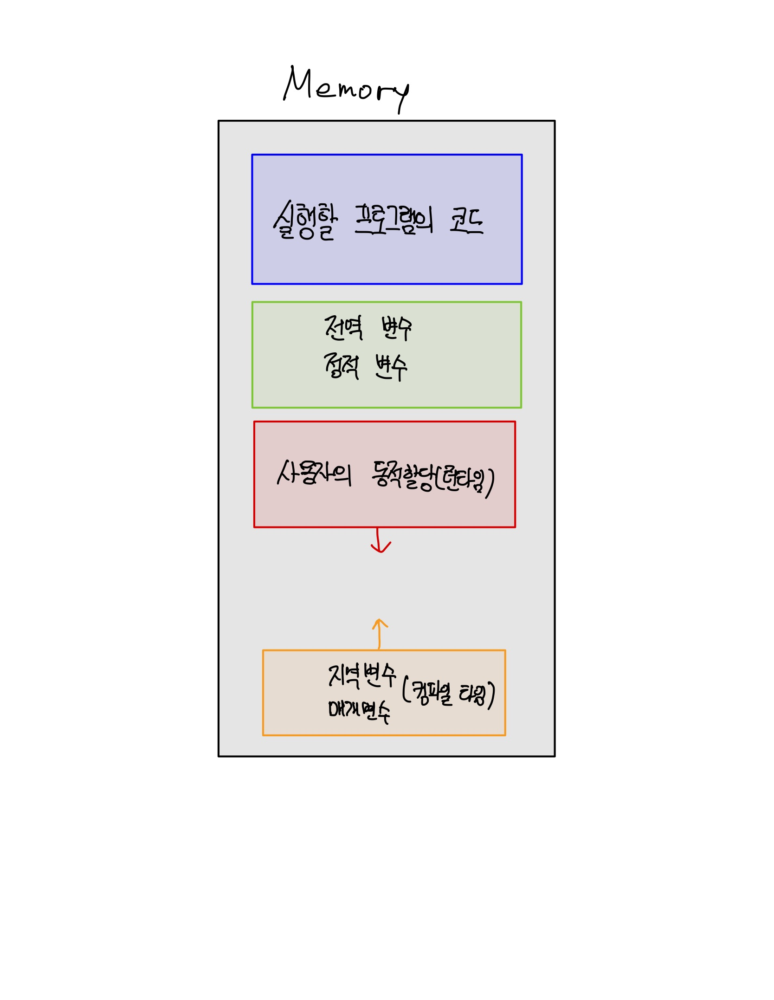

# 프로그램의 실행 순서

먼저 대략적인 컴퓨터 시스템의 구조에 대해서 간단히 알아봅시다.

- 중앙 처리 장치: 두뇌 역할로 각종 연산을 실행합니다.
- 주 기억 장치: 중앙 처리 장치가 처리할 프로그램과 데이터를 **임시로 저장**하는 장치입니다.
- 보조 기억 장치: 프로그램과 데이터 등을 반영구적으로 저장하는 장치입니다.
- 주변 장치: 키보드, 모니터, 프린터 등의 보조기기입니다.

CPU에 대해서 좀 더 알아보면, CPU는 ALU(Arithmetic and Login Unit)라는 논리연산을 수행하는 장치가 있습니다. 그리고, ALU가 연산을 수행할 때, 그 대상이 되는 데이터를 임시로 저장하는 CPU내의 저장공간인 레지스터가 있습니다. ALU는 레지스터에서 데이터를 가져와서 그 결과를 다시 레지스터에 저장합니다.
또, 명령을 해석한 후에 실행을 위해 ALU와 레지스터 파일을 제어하는 회로를 컨트롤 로직이라고 합니다.

보통 프로그래머가 작성한 프로그램은 컴파일 과정을 거쳐 CPU가 바로 해석할 수 있는 기계어의 형태로 번역되어 하드디스크에 저장되었다가 운영체제에 의해서 실행될 때 주기억장치에 올려지고, CPU의 컨트롤 로직에 의해서 하나씩 실행됩니다.
프로그램이 실행될 때 필요한 데이터 또한 하드디스크에 저장되었다가 메모리를 통해 레지스터에 저장된 후 연산에 사용합니다. 연산의 결과값은 레지스터에 저장된 후에 메모리를 거쳐 하드디스크에 저장됩니다.

위의 이미지를 통해 더 설명해보겠습니다. 프로그램의 실행요청이 들어오면, OS는 프로그램의 정보를 보조 기억 장치에서 읽어, 주 기억 장치에 올리게 됩니다. 이 때, OS는 메모리(RAM)에 공간을 할당해줍니다.

할당해주는 메모리 공간은 아래의 그림을 참고해주세요.

이미지에서 빼먹은 부분이 있는데, 위에서부터 코드 영역, 데이터 영역, 힙 영역, 스택 영역이라고 부릅니다.

또, 위쪽으로 갈수록 메모리 주소 번지는 낮고, 아래쪽으로 갈수록 메모리 주소 번지는 높아집니다.

## 메모리 공간

### 코드 영역

우리가 작성한 소스코드가 메모리 상에 저장되는 영역으로 텍스트 영역이라고도 부릅니다. 코드 영역에는 실행 파일을 구성하는 명령어들이 올라가는 메모리 영역으로, 함수, 제어문, 상수 등이 여기에 저장됩니다.

CPU는 코드 영역에 저장된 명령어를 하나씩 가져가서 처리하게 됩니다.

### 데이터 영역

전역 변수와 정적 변수가 할당되는 영역입니다. 프로그램의 시작과 동시에 할당되고, 프로그램이 종료되어야 메모리에서 소멸되는 영역입니다.

### 스택 영역

프로그램이 자동으로 사용하는 임시 메모리 영역입니다. 함수 호출시 생성되는 지역 변수와 매개변수가 저장되는 영역이고, 함수 호출이 완료되면 사라집니다. 이렇게 스택 영역에 저장된느 함수의 호출 정보를 스택 프레임(stack frame)이라고 합니다.

우리가 흔히 얘기하는 스택 오버플로우가 바로 이 스택영역에서 발생하는 대표적인 오류입니다.

스택 영역은 푸시(push) 동작으로 데이터를 저장하고, 팝(pop) 동작으로 데이터를 인출합니다. 이러한 스택은 후입선출(LIFO, Last-In First-Out) 방식에 따라 동작하므로, 가장 늦게 저장된 데이터가 가장 먼저 인출됩니다.
스택 영역은 메모리의 높은 주소에서 낮은 주소의 방향으로 할당됩니다.

### 힙 영역

프로그래머가 할당/해제하는 메모리 공간입니다. Java에서는 Garbage Collector가 자동으로 해제해주는 영역이기도 합니다. 이 공간에 데이터를 저장하는 것을 동적 할당(Dynamic Memory Allocation) 이라고도 부릅니다.

이는 런 타임 시에 유동적으로 크기가 변할 수 있습니다.

---

사실 스택영역과, 힙 영역은 같은 공간을 공유할 수 있습니다. Heap이 메모리 주소의 윗 부분부터 할당된다면, Stack은 아래쪽부터 할당되는 식입니다. 그래서, 각 공간들이 너무 커져 상대 공간을 침범하는 경우가 생길 수 있는데 이를 각각, Heap Overflow, Stack Overflow라고 부릅니다.

### 참고한 사이트

[[컴퓨터 기초] 메모리구조(Memory Structure)](https://medium.com/jinshine-%EA%B8%B0%EC%88%A0-%EB%B8%94%EB%A1%9C%EA%B7%B8/%EC%BB%B4%ED%93%A8%ED%84%B0-%EA%B8%B0%EC%B4%88-%EB%A9%94%EB%AA%A8%EB%A6%AC%EA%B5%AC%EC%A1%B0-memory-structure-4fa6010f333e)

[http://edxlearning.lge.com/assets/courseware/v1/3ec4c76923df4cabb714f10492016b3e/asset-v1:LGE+P00000028+P00000049+type@asset+block/Appendix_3.컴퓨터구조와프로그램의실행과정.pdf](
